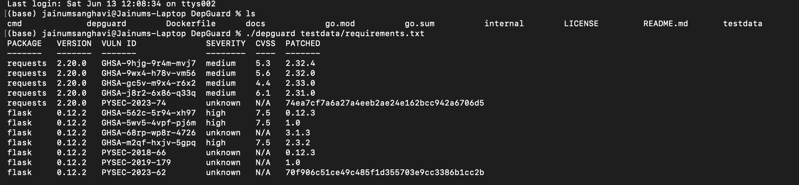
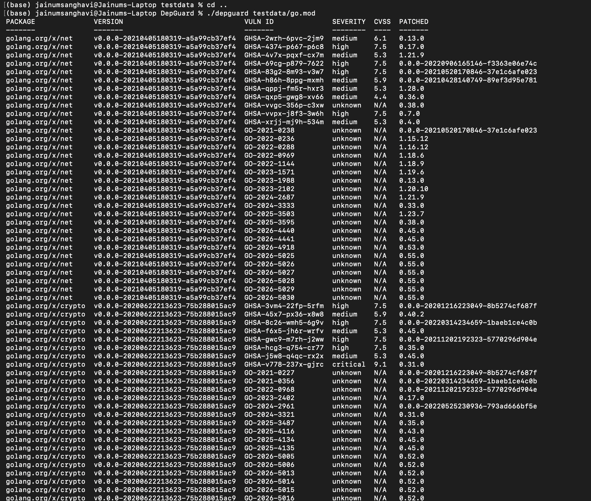

# DepGuard

A command-line vulnerability scanner for dependency manifests. DepGuard reads your `go.mod`, `package.json`, or `requirements.txt`, queries the [OSV.dev](https://osv.dev) vulnerability database, and produces a report of known CVEs with severity scores and patched versions.

Designed to run locally or drop into any CI pipeline as a build gate.

---

## Who it's for

| Role | Use case |
|---|---|
| **Developers** | Audit dependencies before shipping or merging |
| **Security engineers** | Enforce a minimum vulnerability threshold across repos |
| **DevOps / Platform teams** | Add a non-zero exit gate to CI pipelines |

---

## How it works

```
manifest file
    → auto-detect format (go.mod / package.json / requirements.txt)
    → parse declared packages and versions
    → batch query OSV.dev API
    → fetch CVE details concurrently (worker pool, in-memory cache)
    → print table or JSON report
    → exit 1 if --fail-on threshold is met (CI gate)
```

---

## Install

**Binary:**
```bash
go install github.com/JainumSanghavi/DepGuard/cmd/depguard@latest
```

**Docker:**
```bash
docker pull ghcr.io/jainumsanghavi/depguard:latest
```

---

## Usage

```
depguard [flags] <manifest-file>

Flags:
  --include-indirect    include indirect dependencies (go.mod only)
  --json                output JSON instead of a table
  --fail-on=<level>     exit 1 if any vuln at or above: low, medium, high, critical
```

---

## Examples

```bash
# Scan a Python project
depguard requirements.txt

# Scan a Go module including indirect dependencies
depguard --include-indirect go.mod

# Scan a Node.js project
depguard package.json

# Output machine-readable JSON
depguard --json requirements.txt

# CI gate — exit 1 on any high or critical vulnerability
depguard --fail-on=high go.mod
```

**Docker equivalent:**
```bash
docker run --rm -v $(pwd):/work ghcr.io/jainumsanghavi/depguard:latest --fail-on=high /work/go.mod
```

---

## Sample output

**Python (`requirements.txt`)**



**Go (`go.mod`)**



---

## CI integration (GitHub Actions)

```yaml
jobs:
  security:
    runs-on: ubuntu-latest
    steps:
      - uses: actions/checkout@v4
      - name: Scan for vulnerabilities
        run: |
          docker run --rm -v ${{ github.workspace }}:/work \
            ghcr.io/jainumsanghavi/depguard:latest \
            --fail-on=high /work/go.mod
        # Exits 1 and fails the job if any high or critical CVE is found
```

---

## Technical highlights

- **Concurrent CVE lookups** — `golang.org/x/sync/errgroup` worker pool with a semaphore (cap 10) for parallel OSV detail fetches
- **In-memory cache** — deduplicates repeated vuln ID lookups across packages in the same scan
- **CVSS v3 scoring** — computes numeric base scores from CVSS vector strings using the full CVSS v3.1 formula
- **Single external dependency** — only `golang.org/x/sync`; everything else is standard library
- **Docker image** — published to GHCR on every push to `main` via GitHub Actions

---

## License

MIT
